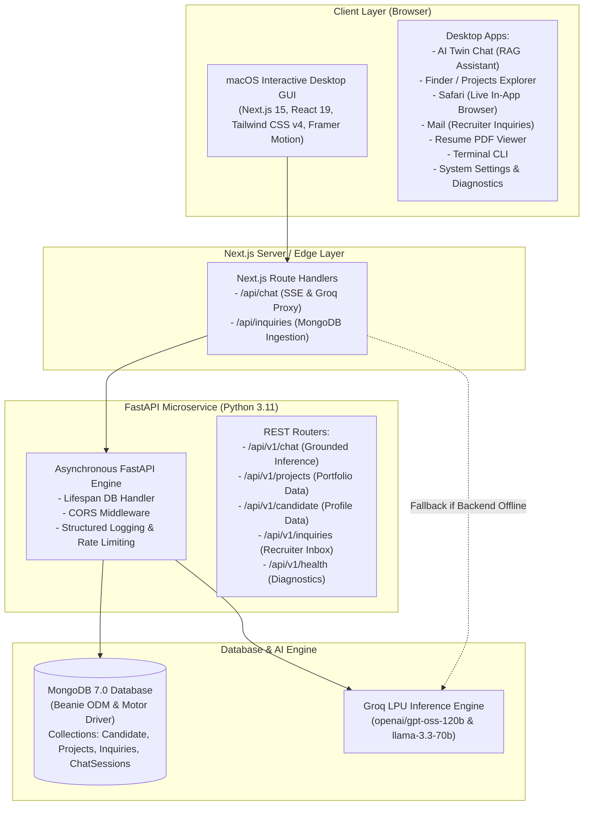

<div align="center">

#  Pranshu Rajan — AI Digital Twin & macOS Desktop Portfolio

**An ultra-modern, production-ready Full Stack AI Portfolio architected as an interactive macOS Sequoia operating system.**  
Grounded in verified systems engineering, featuring autonomous recruiter representation, real-time telemetry, and containerized microservices.

[](https://nextjs.org/)
[](https://tailwindcss.com/)
[](https://www.typescriptlang.org/)
[](https://fastapi.tiangolo.com/)
[](https://www.mongodb.com/)
[](https://www.docker.com/)

[🌐 Live Portfolio Demo](https://pranshu-portfolio.vercel.app) · [💬 Chat with AI Twin](https://pranshu-portfolio.vercel.app) · [📄 View Resume](https://github.com/pranshu-rajan)

</div>

---

## 🏛️ System Architecture



---

## ✨ Flagship Highlights

- **🍎 Pixel-Perfect macOS Sequoia GUI**: Dock with magnification, draggable & minimizable windows, dynamic spotlight search, multi-wallpaper changer, synthetic audio effects, and mobile-responsive drawer mode.
- **🤖 Autonomous AI Digital Twin**: Grounded in verified engineering accomplishments, internships at Xtin Capital & Edunet IBM, and academic credentials from Nirma University.
- **⚡ Dual Mode Execution**: Seamlessly connects to the **FastAPI & MongoDB** backend for database persistence and session tracking, while offering automatic zero-latency fallback if run standalone.
- **📬 Recruiter Outreach Pipeline**: In-app Mail client that stores recruiter inquiries directly into MongoDB with instantaneous visual confirmation and native mail client triggering.
- **🛠️ Production Multi-Stage Docker**: Fully containerized using root `docker-compose.yml` for unified local development and rapid cloud container deployments.

---

## 🚀 Quickstart Guide

### Option 1: One-Click Full-Stack Launch with Docker Compose (Recommended)

Run the entire full-stack (Next.js + FastAPI + MongoDB) with a single command:

```bash
# Clone the repository
git clone https://github.com/pranshu-rajan/ai-portfolio.git
cd ai-portfolio

# Configure environment variables
cp .env.example .env.local

# Launch frontend, backend, and MongoDB containers
docker compose up --build
```

- **Frontend Desktop**: [http://localhost:3000](http://localhost:3000)
- **FastAPI Interactive Docs**: [http://localhost:8000/docs](http://localhost:8000/docs)
- **MongoDB Connection**: `mongodb://localhost:27017`

---

### Option 2: Local Development Setup

#### 1. Start MongoDB (via Docker or Local Service)
```bash
docker run -d --name portfolio_mongodb -p 27017:27017 -v mongo_data:/data/db mongo:7.0
```

#### 2. Setup and Run the FastAPI Backend
```bash
cd backend

# Create virtual environment
python -m venv .venv
source .venv/bin/activate   # On Windows: .venv\Scripts\activate

# Install dependencies
pip install -r requirements.txt

# (Optional) Seed verified projects & candidate profile into MongoDB
python scripts/seed_db.py

# Start FastAPI server
uvicorn app.main:app --reload --port 8000
```

#### 3. Setup and Run the Next.js Frontend
```bash
# In the root directory:
npm install

# Start development server
npm run dev
```

Open [http://localhost:3000](http://localhost:3000) to view the application.

---

## 🌐 Production Deployment Guide

### Deploying Frontend to Vercel
1. Push your repository to GitHub.
2. Import the project into [Vercel](https://vercel.com).
3. Set the following environment variables in Vercel Project Settings:
   - `NEXT_PUBLIC_API_URL`: URL of your deployed backend (e.g. `https://your-backend.onrender.com`)
   - `FASTAPI_BACKEND_URL`: URL of your deployed backend
   - `GROQ_API_KEY`: Your Groq API key (optional for fallback/direct inference)
   - `GROQ_MODEL`: `openai/gpt-oss-120b`
4. Click **Deploy**.

### Deploying Backend to Render / Railway
1. Create a new **Web Service** pointing to the `backend/` directory or root `backend/Dockerfile`.
2. Connect a free cloud **MongoDB Atlas** cluster and configure:
   - `MONGODB_URI`: `mongodb+srv://<user>:<password>@cluster.mongodb.net/?retryWrites=true&w=majority`
   - `MONGODB_DB_NAME`: `pranshu_portfolio_db`
   - `CORS_ORIGINS`: `["https://your-portfolio.vercel.app"]`
   - `GROQ_API_KEY`: Your Groq API Key
   - `GROQ_MODEL`: `openai/gpt-oss-120b`
3. Expose port `8000` with start command: `uvicorn app.main:app --host 0.0.0.0 --port 8000`.

---

## 📡 API Endpoints Reference

| Method | Route | Description |
|---|---|---|
| `GET` | `/health` | Service and MongoDB ping diagnostic check |
| `GET` | `/api/v1/health` | API v1 health status endpoint |
| `POST` | `/api/v1/chat` | AI Twin grounded inquiry inference |
| `POST` | `/api/v1/chat/stream` | Token-streaming SSE chat endpoint |
| `GET` | `/api/v1/projects` | List all engineering projects with filters |
| `GET` | `/api/v1/projects/{slug}` | Retrieve single project metadata by slug |
| `GET` | `/api/v1/candidate` | Retrieve verified candidate profile |
| `POST` | `/api/v1/inquiries` | Persist recruiter outreach into MongoDB |

---

## 🔑 Environment Variables

### Frontend (`.env.local`)
```env
NEXT_PUBLIC_API_URL=http://localhost:8000
FASTAPI_BACKEND_URL=http://localhost:8000
GROQ_API_KEY=gsk_...
GROQ_MODEL=openai/gpt-oss-120b
```

### Backend (`backend/.env`)
```env
ENVIRONMENT=development
PORT=8000
HOST=0.0.0.0
MONGODB_URI=mongodb://localhost:27017
MONGODB_DB_NAME=pranshu_portfolio_db
GROQ_API_KEY=gsk_...
GROQ_MODEL=openai/gpt-oss-120b
FALLBACK_MODEL=llama-3.3-70b-versatile
CORS_ORIGINS=["http://localhost:3000","http://127.0.0.1:3000"]
ADMIN_API_KEY=dev_admin_secret_key
RATE_LIMIT_PER_MINUTE=60
```

---

## 👨‍💻 Engineer & Contact

**Pranshu Rajan**  
*Full Stack Developer & AI Engineer*  
- **Email**: [pranshurajan9211@gmail.com](mailto:pranshurajan9211@gmail.com)
- **LinkedIn**: [linkedin.com/in/pranshu-rajan](https://www.linkedin.com/in/pranshu-rajan/)
- **GitHub**: [github.com/pranshu-rajan](https://github.com/pranshu-rajan)
- **Location**: Ahmedabad, Gujarat, India

---

## 📄 License
MIT License © 2026 Pranshu Rajan. Built for high-impact software engineering recruitment and demonstration.
